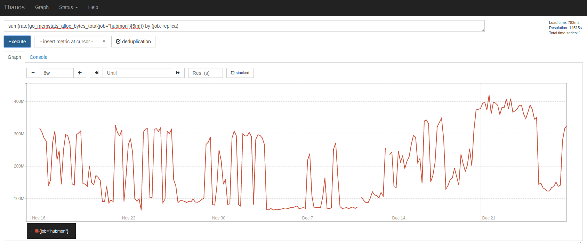
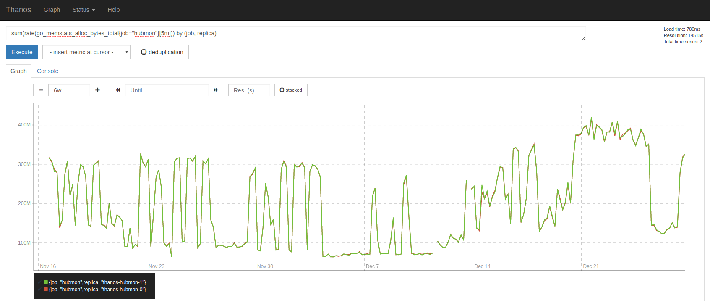

## Overview

Thanos is a set of components that can be composed into a highly available metric system with unlimited storage capacity. It can be added seamlessly on top of existing Prometheus deployments and leverages the Prometheus 2.0 storage format to efficiently access great amounts of metric data in an object storage.

* [Getting Started](#getting-started)
* [Concepts](docs/design.md)

## Getting started

### Requirements

* One or more [Prometheus](https://prometheus.io) installations
* An object storage bucket (optional)

### Get Thanos!

Thanos has no official releases yet. With a working installation of the Go toolchain, Thanos can be downloaded and built by running

```
go get github.com/improbable-eng/thanos/...
go build github.com/improbable-eng/thanos/cmd/thanos
```

The `thanos` binary can be found in the current working directory. Nothing else is needed to deploy any of the Thanos components.

### Sidecars

Thanos integrates with existing Prometheus servers through a sidecar process, which runs on same machine/in the same pod as the Prometheus server itself.

* [How to deploy the sidecar](docs/components/sidecar.md#deployment)

After all Prometheus servers that should be part of the Thanos cluster are paired with a sidecar, the querying layer can be deployed.
The sidecar can be configured to backup data to an object storage, from where it can be queried later. This is however not required to make use of Thanos' querying capabilities.

### Query Layer

The query layer is a stateless and horizontally scalable component of Thanos. It can find sources of metric data, such as the deployed sidecars, and evaluate PromQL expressions against their data.

It hosts the Prometheus querying UI and implements its HTTP API, which allows tools such as Grafana to use it just like a regular Prometheus server.

* [How to deploy query nodes](docs/components/query.md#deployment)

After a query node is deployed and connected to the cluster, it provides a global view of all available data. This means metrics from different Prometheus servers can be combined within a single query.

It can deduplicate data that was collected from high-availability pairs of Prometheus servers and thereby seamlessly closes gaps caused by downtime of single instances.

A combination of sidecars and query nodes already provides a very useful system.
Next, we can extend this by making data that was backed up to our object storage queryable.

* Example graph of deduplicated series from HA Prometheus instances over long period (6 weeks):


* Example graph of raw series from HA Prometheus instances over long period (6 weeks):


### Store Node

Store nodes act as a Thanos-internal querying frontend for metric data in an object storage. The query layer detects them as a source of metric data and fans out its queries to store nodes and sidecars alike.

* [How to deploy store nodes](docs/components/store.md#deployment)

All data that is backed up into the object storage by a sidecar will be detected by the store node and become available for querying. Thus the retention time of Prometheus servers can be shortened to just a few hours.

### Rule Node

Since Prometheus servers are essentially left untouched, they can continue to evaluate alerting and recording rules. Over time however, Thanos' global query view and data deduplication may become desirable for rule evaluation too.

Rule nodes can evaluate known Prometheus rules against the Thanos' querying layer. They can be deployed in a highly-available manner and metrics they produce are instantly visible within Thanos.

* [How to deploy rule nodes](docs/components/rule.md#deployment)

### Compactor

Metric data stored in the object storage is in the same format as on Prometheus' local disk. Similarly to compaction processes done by Prometheus, Thanos' can greatly benefit from data in the object storage being compacted.

The compactor is a singleton component that continously ensures that data blocks in the object storage are consolidated, which reduces data size and increases query efficiency.

* [How to deploy the compactor](docs/components/compact.md#deployment)

It is not necessary to deploy the compactor to try out Thanos.

In the future, the compactor will also take on tasks such as dynamic retention and downsampling.

## Contribution

Contributions are very welcome!


[](https://travis-ci.org/improbable-eng/thanos) [](https://goreportcard.com/report/github.com/improbable-eng/thanos)