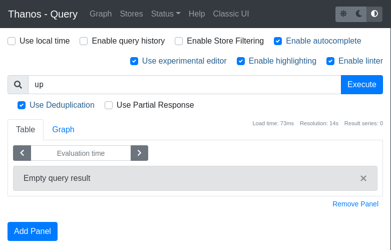

# Setup Thanos Receive

With `prometheus-batcave` & `prometheus-batcomputer` now running, we need to think about how we satisfy our two requirements:
1. Implement a global view of this data.
1. Global view must be queryable in near real-time.

How are we going to do this?

## Thanos Sidecar

After completing [Tutorial #1: Global View](https://www.katacoda.com/thanos/courses/thanos/1-globalview), you may think of running the following architecture:

* Run Thanos Sidecar next to each of the Prometheus instances.
* Configure Thanos Sidecar to upload Prometheus data to an object storage (S3, GCS, Minio).
* Run Thanos Store connected to the data stored in object storage.
* Run Thanos Query to pull data from Thanos Store.

However! This setup **does not** satisfy our requirements above.

<details>
 <summary>Can you think why?</summary>

Since we cannot access the `Thanos Sidecar` directly - we cannot query metrics data in real-time.

`Thanos Sidecar` only uploads `blocks` of metrics data that have been written to disk, which happens every 2 hours in Prometheus.
<br>
This means that the Global View would be at least 2 hours out of date, and does not satisfy requirement #2.
</details>

## Thanos Receive

Enter [Thanos Receive](https://thanos.io/tip/components/receive.md/).

`Thanos Receive` is a component that implements the [Prometheus Remote Write API](https://prometheus.io/docs/prometheus/latest/configuration/configuration/#remote_write). This means that it will accept metrics data that is sent to it by other Prometheus instances.

Prometheus can be configured to `Remote Write`. This means that Prometheus will send all of its metrics data to a remote endpoint as they are being ingested - useful for our requirements!

In its simplest form, when `Thanos Receive` receives data from Prometheus, it stores it locally and exposes a `Store API` server so this data can be queried by `Thanos Query`.

`Thanos Receive` has more features that will be covered in future tutorials, but let's keep things simple for now.

## Run Thanos Receive

The first component we will run in our new architecture is `Thanos Receive`:

```
docker run -d --rm \
    -v $(pwd)/receive-data:/receive/data \
    --net=host \
    --name receive \
    quay.io/thanos/thanos:v0.22.0-rc.0 \
    receive \
    --tsdb.path "/receive/data" \
    --grpc-address 127.0.0.1:10907 \
    --http-address 127.0.0.1:10909 \
    --label "receive_replica=\"0\"" \
    --label "receive_cluster=\"wayne-enterprises\"" \
    --remote-write.address 127.0.0.1:10908
```{{execute}}

Let's talk about some important parameters:
* `--label` - `Thanos Receive` requires at least one label to be set. These are called 'external labels' and are used to uniquely identify this instance of `Thanos Receive`.
* `--remote-write.address` - This is the address that `Thanos Receive` is listening on for Prometheus' remote write requests.

Let's verify that this is running correctly. Since `Thanos Receive` does not expose a UI, we can check it is up by retrieving its metrics page.

```
curl http://127.0.0.1:10909/metrics
```{{execute}}

## Run Thanos Query

Next, let us run a `Thanos Query` instance:

```
docker run -d --rm \
    --net=host \
    --name query \
    quay.io/thanos/thanos:v0.22.0-rc.0 \
    query \
    --http-address "0.0.0.0:39090" \
    --store "127.0.0.1:10907"
```{{execute}}

`Thanos Receive` exposed its gRPC endpoint at `127.0.0.1:10907`, so we need to tell `Thanos Query` to use this endpoint with the `--store` flag.

Verify that `Thanos Query` is working and configured correctly by looking at the 'stores' tab [here](https://[[HOST_SUBDOMAIN]]-39090-[[KATACODA_HOST]].environments.katacoda.com/stores).

Now we are done right? Try querying for some data...



<details>
 <summary>Uh-oh! Why are we seeing 'Empty Query Result' responses?</summary>

We have correctly configured `Thanos Receive` & `Thanos Query`, but we have not yet configured Prometheus to write to remote write its data to the right place.

</details>

Hit continue and we will fix this setup!